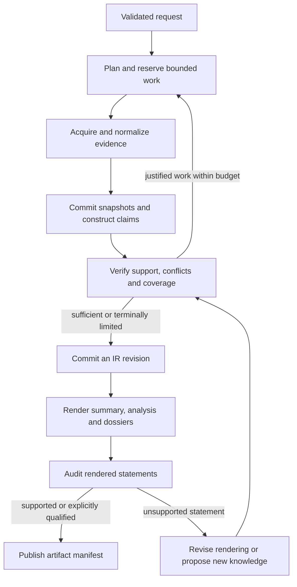

# Separate Research Execution, Knowledge, and Rendering

- Status: accepted
- Deciders: Magnus Hedemark
- Date: 2026-09-04
- Scope: experimental research backend in `magnus919/groktocrawl-x`
- Plan: D1 / W1; issue [#3](https://github.com/magnus919/groktocrawl-x/issues/3)
- Supersedes: experimental scope only, as classified in the inherited-impact table; inherited endpoints remain unchanged

- Accepted: 2026-09-05 by Magnus Hedemark, following the W1 review packet.
- Acceptance scope: foundation contracts for a bounded fixture-backed prototype;
  implementation/evidence gates remain. No storage/runtime/recovery selection or
  external-provider spending is authorized by this acceptance.
- Acceptance record: [issue #15](https://github.com/magnus919/groktocrawl-x/issues/15).

## Context and Problem Statement

The [experiment charter](0067-establish-an-independent-research-architecture-experiment.md)
and [discussion #427](https://github.com/groktopus/groktocrawl/discussions/427)
identify three different things that research creates: execution history, knowledge,
and presentation. The inherited pipeline's compact event-derived `ResearchState`
reports progress; local variables and the async call stack still carry execution.
A rendered answer and its source URLs are not sufficient to reproduce claim support
or independently improve verification.

The target needs explicit execution decisions, a portable claims-and-evidence
representation, and several renderings of the same knowledge. Replacing these
responsibilities need not imply rewriting deterministic retrieval or choosing a
graph runtime, database, or durable engine in this ADR.

## Decision Drivers

- Inspect and change research policy without coupling it to a transport or framework.
- Re-render and re-verify retained evidence without mandatory reacquisition.
- Separate completion of work from confidence in the answer.
- Keep budgets, concurrent ownership, cancellation and terminal outcomes explicit.
- Preserve the evidence needed to assess mistakes and conflicting claims.

## Considered Options

| Option | Advantages | Disadvantages |
|---|---|---|
| Extend the existing prose/event projection | Least new structure; current clients already consume it | Execution decisions and semantic support remain implicit; cached prose becomes the knowledge authority |
| Put state, full documents and output in a graph checkpoint | Convenient access inside a single runtime | Couples portable knowledge to execution internals, grows checkpoints, conflates retention and recovery |
| Separate execution, Knowledge IR and rendering contracts | Independent verification, storage and runtime evolution; explicit ownership | Requires versioned interfaces and publication rules across components |

## Decision Outcome

Propose the third option. The following are logical boundaries; they do not specify
new network services or require the current deployment topology.

| Boundary | Owns | Consumes / produces | Does not decide |
|---|---|---|---|
| Client edge | Authentication, request validation, transport and client compatibility | Public request → internal request; application events/artifact → response | Research conclusions or framework-specific state |
| Execution controller | Planned work, branching, budgets, cancellation, retries delegated to one execution owner, completion reason | Commands and tool outcomes → next work and proposed knowledge updates | Whether a citation semantically proves a claim |
| Retrieval tools | Search, scrape, crawl, normalization and acquisition metadata | Bounded requests → evidence candidates/snapshot descriptors | Research policy or permission/budget increases |
| Knowledge construction and verification | Claims, support, conflicts, derivations and verification records | Committed snapshots + context → immutable IR revision | Retry ownership or how an SSE connection behaves |
| Artifact rendering and audit | Summary, analysis, dossiers and their statement-to-claim map | One IR revision → audited artifact set | Silent addition of new factual claims |
| Persistence/recovery interfaces | Snapshot/IR/artifact commits, versions and ownership checks | Idempotent write intent → committed identities | Storage engine or recovery technology before D3/D5 |

### Execution state

The new controller's `ResearchState` is authoritative operational state, unlike the
inherited progress projection. Keep the existing projection as an adapter until its
consumers migrate; do not silently redefine its persisted/event schema. The new
state records `run_id`, request/policy versions, objective/as-of constraints,
planned/pending/completed operation IDs, budget limits/reservations/usage, pass and
checkpoint identities, selected IR/artifact revisions, cancellation and stop reason.
Evidence bodies and rendered prose stay in their artifact stores.

A logical run owner accepts state transitions and budget reservations. Concurrent
workers return operation-keyed outcomes; they never independently overwrite shared
state. The controller rejects stale revisions and duplicate effects, records the
ordering decision, and applies deterministic reducers where parallel results merge.
D4 selects the runtime implementation; D5 defines persisted ownership/fencing and
what is recoverable after a process loss. A checkpoint is not an execution lease.

Every loop, including render repair, consumes explicit deterministic limits. No
LLM response can raise those limits. At exhaustion, publish a qualified partial
artifact if policy permits, or fail with an explicit reason; never loop indefinitely.

### Publication and completion

Commit source snapshots before publishing an IR revision that refers to them.
Commit an IR revision before publishing a final artifact manifest. A manifest pins
one IR revision and all three output artifact IDs/digests; partial staging data is
not a completed artifact. These are observable requirements, not an assertion that
cross-store atomic transactions already exist. D3/D5 choose an implementation and
cleanup/recovery behavior, including a crash between any two commits.

Keep separate fields for execution outcome (`completed`, `failed`, `cancelled`),
answer coverage (`complete`, `partial`, `insufficient`) and stop reason (for example
`coverage_satisfied`, `budget_exhausted`, `unresolved_conflict`, `provider_failure`).
A completed run can correctly report insufficient evidence. A provider failure is
not recategorized as a successful answer unless an explicitly versioned partial-
result policy permits the retained evidence to answer part of the request.

Renderers may propose a new inference, but must send it through knowledge
construction and verification before treating it as an approved claim. Publishing
prose does not mutate the underlying knowledge. Re-verification creates a new IR
revision and leaves earlier evidence/verification history available according to
retention policy. Publication eligibility never means universal truth.

### Transport boundary

Use application-owned progress and terminal events; translate runtime events at the
edge. Do not expose graph node names, checkpoint encodings or raw model reasoning as
public contracts. Record bounded decision rationales and evidence references rather
than private chain-of-thought. D6 decides verified-only streaming versus an explicit
provisional/revision protocol, reconnect behavior and all API/CLI/MCP changes. This
ADR does not authorize streaming unaudited text as verified output.

## Inherited Decision Impact

The following changes apply to the experimental path upon acceptance and adoption;
no predecessor status is changed by this proposal.

| Record | Intended relationship | Exact scope |
|---|---|---|
| ADR-0017 | Partially supersede | Replace direct document-to-answer synthesis in the experimental answer path with construction/verification/rendering; public endpoint and compatibility decisions await D6 |
| ADR-0022 | Extend; D6 may supersede protocol details | Retain one execution model for streaming/polling; do not adopt framework events as the wire format |
| ADR-0024 (proposed) | Retain output organization, extend inputs | Preserve summary/analysis/dossiers; all renderers consume a pinned IR revision |
| ADR-0040/0041 (proposed) | Replace knowledge-source assumption | Compact sessions and semantic reuse remain useful; accumulated/cached prose is not the authoritative research product |
| ADR-0050/0059 | Extend | Keep artifact reuse and deterministic acquisition; introduce independently versioned evidence snapshots |
| ADR-0064 | Partially supersede | Final answer construction becomes claim verification plus rendering/audit; retain one coherent final artifact and no unmarked drafts |
| ADR-0047, 0063, 0066 | Leave current implementation unchanged pending D3/D5/D6 | Their store/lease/job contracts do not predetermine the experiment's persistence and recovery architecture |

## Consequences

Knowledge becomes independently exportable, verifiable and renderable. Framework
selection can be tested against a stable contract. The cost is additional schemas,
revision publication, and potentially additional model calls. Existing output
latency goals must be re-evaluated. A bad extraction can still lose important
context; snapshots and source spans must remain available to verification.

## Confirmation

Before W2 ships, the research owner provides fixtures showing one supported answer,
one unresolved conflict and one insufficient-evidence result through construction,
verification and rendering. Validate stable operation IDs under duplicate/reordered
outcomes, rejected stale commits, deterministic budget exhaustion and no evidence
bodies in operational state. An audited artifact pins exactly one IR revision.
D3/D5 later add fault injection at each publication boundary; until those pass,
restart safety remains unverified. Missing results fail the corresponding gate.

Magnus reviews ownership and inherited-impact scope at ADR acceptance. Revisit this
decision if a public interface exposes runtime internals, a new knowledge format is
required, or the recovery design cannot implement the publication contract.

## Links

- [Knowledge IR contract](0069-define-versioned-knowledge-and-verification.md)
- [Evaluation contract](0070-evaluate-research-policy-and-runtime-separately.md)
- [Worked example](../experiments/research-foundation-example.md)
- [Experiment plan](../experiments/research-architecture.md)
