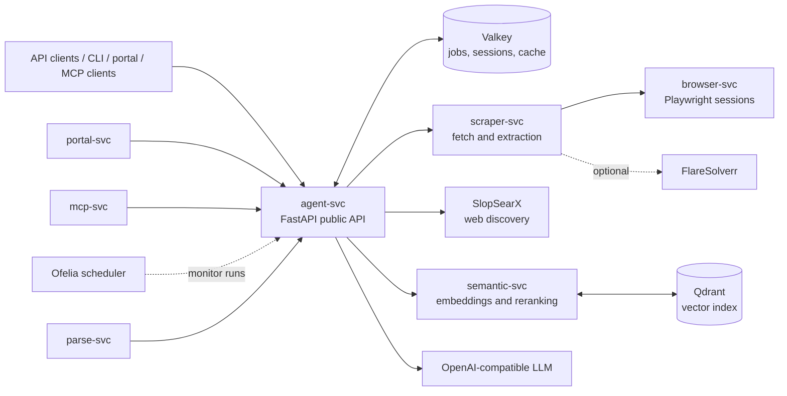
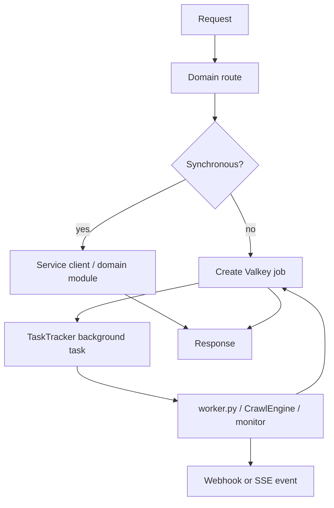
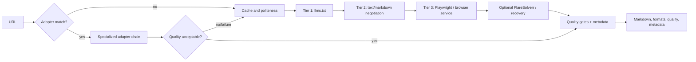

# GroktoCrawl architecture

## System context

`agent-svc` owns the public `/v2` API, authorization, request IDs, health and metrics. It composes domain routers from `agent/routes/`, owns background tasks through `TaskTracker`, and stores persistent job records in Valkey. Jobs are processed in-process with `asyncio.create_task()`; there is no external job owner or worker queue.

## Main execution paths

### Asynchronous job durability contract

Valkey makes job metadata, status, and completed results persistent; it does not make execution restart-safe. `TaskTracker` gives in-flight work a five-second grace period during an orderly shutdown, then cancels remaining tasks. A crash, forced termination, or restart does not resume or reclaim interrupted jobs.

After process loss:

- A job record may remain `processing` until its TTL expires because no recovery pass changes its state.
- A cancellation request can update persisted state, but there is no interrupted task to resume or durable execution lease to revoke.
- Partial artifacts already written to Valkey, Qdrant, or another downstream system can remain; there is no transaction or rollback across those stores.
- A completion or failure webhook that was not delivered before exit is not replayed automatically.

Restart-safe execution is deliberately deferred; [ADR-0047](adr/0047-defer-restart-safe-execution.md) records the durability contract, SLO boundary, target architecture (Valkey-native execution leases and a webhook outbox), and the roadmap milestones (M1–M5) that will implement it. If operational evidence establishes restart-safe execution as a product requirement, implementation must follow that ADR's milestones — defining the durable owner, lease and reclaim rules, retry policy, cancellation semantics, artifact consistency, and idempotent webhook delivery before selecting queue technology. Operators reconcile jobs stranded in `processing` after process loss per the [Interrupted Jobs runbook](runbooks/interrupted-jobs.md). This boundary extends the best-effort decision in [ADR-0035](adr/0035-graceful-shutdown.md).

Research code lives in `agent/research/`: it plans a query, discovers sources, scrapes them, synthesizes with the LLM, optionally detects gaps for another pass, and can stream progress and tokens. Research memory combines Valkey metadata with semantic lookup. Crawl uses a breadth-first engine with sitemap discovery, path filters, concurrency, cache controls, robots/politeness handling, canonical/content deduplication, and SSE progress.

## Scraping pipeline

Adapters cover publishing and media, source code and GitHub social content, recruitment, commerce, public-domain books, and security/threat intelligence. They are registered in-process and use per-adapter fallback chains; the generic pipeline remains the final fallback.

## Semantic retrieval

`semantic-svc` loads its embedding model during application lifespan and exposes embedding, reranking, index, migration, retention, and search routers. Qdrant persists named-vector collections. `GET /health` is the backward-compatible liveness and component-detail surface; `GET /ready` returns HTTP 503 until the models and configured serving vector store are available. Compose uses `/ready` for routing readiness. `agent-svc` treats indexing as best effort, so a semantic-service outage does not fail a scrape or crawl request.

## Performance telemetry

Stage-level latency and capacity signals are recorded with bounded labels and exported as `groktocrawl_*` metrics (see [ADR-0048](adr/0048-stage-level-telemetry.md) and `docs/observability.md`). Research stages, cache lookups, browser semaphore saturation, scrape-tier/adapter outcomes, active-work/cancellation counts, and streaming time-to-first-event/token are all observable per service. `benchmarks/run_benchmarks.py` reproduces p50/p95 across cold/warm/lightweight/browser fixtures and writes a portable, checked-in baseline artifact — the evidence gate for future browser-process-reuse and adapter-investment decisions.

## Operational boundaries

- Valkey is the shared state boundary for jobs, monitor/session data, and caches.
- Qdrant is the persistent vector-index boundary.
- SlopSearX and the configured LLM are external capabilities; their availability is surfaced through health checks and request failures/degradation.
- `portal-svc` and `mcp-svc` are thin clients of the public agent API; they do not own duplicate business logic.
- `ofelia` triggers scheduled monitor execution through the agent service.

## Decisions

Accepted decisions describe the architecture currently relied upon; proposed ADRs describe possible future work and are not implementation commitments. See the [ADR index](adr/README.md), especially accepted ADRs for adapters, webhooks, observability, crawl, settings, lifecycle management, and SlopSearX migration.
