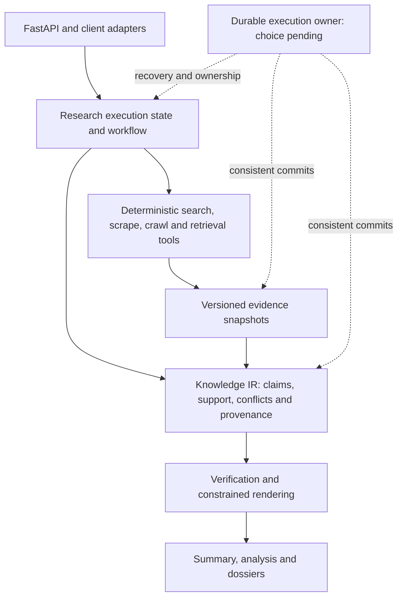

# GroktoCrawl X: experimental research architecture plan

- Status: planning; runtime work has not started
- Accountable owner and architecture decider: Magnus Hedemark (`magnus919`)
- Date: 2026-09-04
- Repository: [magnus919/groktocrawl-x](https://github.com/magnus919/groktocrawl-x)
- Mainline: [groktopus/groktocrawl](https://github.com/groktopus/groktocrawl)
- Starting revision: [`34b4975bc7baaf25510ed34029b957f95b59de70`](https://github.com/groktopus/groktocrawl/commit/34b4975bc7baaf25510ed34029b957f95b59de70)
- Input: [discussion #427 and its Knowledge IR follow-up](https://github.com/groktopus/groktocrawl/discussions/427)
- Tracking issue: [#1](https://github.com/magnus919/groktocrawl-x/issues/1)
- Proposed charter: [ADR-0067](../adr/0067-establish-an-independent-research-architecture-experiment.md)

**This is an experimental fork, not a replacement for mainline GroktoCrawl.**
The owner authorized creating and planning the fork, explicitly including new ADRs
that can overturn inherited architecture. Specific technical decisions below are
open until their ADRs are reviewed. This plan does not authorize a mainline rewrite,
production migration, paid evaluation run, or upstream release.

The repository preserves upstream main's complete reachable Git history. It is a
separate GitHub repository, as requested after GitHub returned the owner's existing
fork. The existing `magnus919/groktocrawl` repository is unchanged.

## Intended outcome

A research request produces an inspectable, reusable body of claims and evidence.
A specialized workflow plans, gathers, assesses, deepens, verifies, and renders
that knowledge under explicit budgets. Execution state, knowledge, and presentation
have distinct lifecycles. The output remains a three-layer Artifact Pyramid:
summary, analysis collection, and detailed dossiers. Whether LangGraph, another
explicit workflow library, or a typed imperative implementation best supports this
is a decision to test. Durable execution, potentially Temporal, is a first-class
architecture decision rather than automatically deferred by ADR-0047.

The experiment keeps deterministic retrieval/crawl behavior outside LLM judgment.
The data plane is a reusable capability boundary; the current deployment topology
is not mandatory. Existing Python/FastAPI tools and the OpenAI-compatible provider
boundary are useful starting assets, subject to explicit interface decisions.



This diagram is the proposed responsibility model, not a deployed service map.

## Baseline and scope

The fork starts after upstream ADRs 0059–0066. The research core already shares an
event engine, reuses artifacts across passes, performs gap-directed acquisition,
and emits one final synthesis. Progressive acquisition and optional independent
session steps also exist. Re-measure this baseline; do not sell those existing
features as benefits attributable to a new framework.

In scope: architecture replacement decisions; portable Knowledge IR; evidence
verification; reusable artifacts; explicit workflow state and budgets; resumability
requirements; client/event contracts; framework comparison; isolated rollout.

Outside this plan: mainline replacement; a generic multi-agent swarm; rebuilding
all adapters; managed hosting or billing; assuming an entire production tenancy
model; publishing fork builds under upstream image/package identities. Additional
requirements require a recorded scope decision, not an incidental implementation.

## Architecture decision work

Write these as separate MADR records in `docs/adr/` before the dependent production
implementation. Bounded evaluation spikes may precede runtime selection; they do
not silently accept their candidate ADR. D1–D7 are backlog IDs, not reserved ADR
numbers. Allocate the next available four-digit number when each PR is opened.

| ID | New ADR to write | Decisions and alternatives to resolve | Inherited decisions to assess | Acceptance evidence / due gate |
|---|---|---|---|---|
| D1 | Separate research execution, knowledge, and rendering | Ownership, module/service boundaries, specialized workflow, portable contracts; compare event-first orchestration with explicit graph state | 0017, 0023, 0040, 0042, 0050, 0063–0066 | State transitions, dependency diagram, single-writer/commit rules; before W2 |
| D2 | Define a versioned Knowledge IR and verification contract | Claim identity; snapshot and span references; support, contradiction and derivation edges; epistemic statuses; source quality/freshness; verifier provenance; human vs machine review labels | 0004, 0016, 0024, 0041, 0049, 0050, 0059, 0064 | Example valid/invalid records and render/audit invariants; before W2 |
| D3 | Store and retain evidence independently of sessions | Authoritative store; local/object/blob and metadata options; Valkey's role; derived vector index; pgvector consolidation versus Qdrant if PostgreSQL is adopted; retention, export, garbage collection, schema/model migrations | 0019, 0026–0030, 0040–0041, 0049–0050, 0059, 0063, 0066 | Expired-session, deleted-source, partial-write and restore scenarios; before W3 |
| D4 | Select the research orchestration runtime | LangGraph vs current/typed imperative loop vs a bounded alternative such as Pydantic Graph; reducers, retries, context propagation, cancellation, state migration, operational footprint | 0022, 0031, 0033, 0035, 0040, 0048, 0051, 0064–0066 | Same-policy conformance comparison and engineering assessment; after W4 spike, before adoption |
| D5 | Define durable execution ownership and recovery | Explicit recovery target; Temporal vs Valkey leases/outbox vs graph-only recovery; one owner of retries/cancellation; idempotency, leases, side effects, artifact commit, webhook outbox | 0012, 0035, 0038, 0045, 0047, 0051, 0063, 0066 | Crash matrix and recovery/cancellation proof; before W5 implementation; expressly revisit 0047 |
| D6 | Expose verified artifacts through compatible client protocols | FastAPI edge; stable source/claim IDs; SSE lifecycle; provisional vs verified text; checkpoint/event replay; compact sessions; JSON/schema output; API/CLI/MCP parity | 0017, 0022, 0024, 0032, 0039–0042, 0053, 0064–0066 | Wire examples and golden client traces; before W6 |
| D7 | Evaluate and adopt or reject the new architecture | Fixed comparison design; realistic quality evaluation; uncertainty and cost/latency limits; evidence retention; continuation and abandonment criteria | 0018, 0048, 0054–0057 plus existing answer evals | Pinned manifest, rubric, hard gates, cost ceiling and decision report template; before comparisons |

Every new ADR must include status, decider, date, context, drivers, options with
tradeoffs, outcome, consequences, links, and a confirmation plan. Its impact table
must classify each affected predecessor as retained, extended, partially superseded,
or superseded. References in the table above identify review candidates, not a
blanket declaration that all those records are obsolete.

At acceptance, update only predecessor status/successor references and the index,
with the exact scope of partial supersession. Keep accepted decision bodies and
historical links intact. Update affected AGENTS.md guidance, architecture diagrams,
operator docs and tests in the implementation PR. Do not change upstream ADR status.
In particular, the mainline preference for Valkey-native durability and deferral of
Temporal is an input to D5, not a constraint on its outcome.

## Architecture foundation draft status

Following merged PR #2, [issue #3](https://github.com/magnus919/groktocrawl-x/issues/3)
tracks the first W1 decision package:

- D1: [ADR-0068 — execution, knowledge and rendering boundaries](../adr/0068-separate-research-execution-knowledge-and-rendering.md), accepted 2026-09-05.
- D2: [ADR-0069 — versioned Knowledge IR and verification](../adr/0069-define-versioned-knowledge-and-verification.md), accepted 2026-09-05.
- D7: [ADR-0070 — separate runtime and policy evaluation](../adr/0070-evaluate-research-policy-and-runtime-separately.md), accepted 2026-09-05.
- [Worked conflicting-source example](research-foundation-example.md), with immutable
  snapshot hashes, evidence locators, expected claims/verification, three renderings
  and failure variants. It is synthetic design evidence, not a runtime test result.

D3 now has a proposed storage decision in [ADR-0071](../adr/0071-store-research-evidence-independently-of-sessions.md),
tracked by [issue #5](https://github.com/magnus919/groktocrawl-x/issues/5), with a
[lifecycle and failure matrix](research-storage-lifecycle.md). It recommends a
single authoritative PostgreSQL store for bounded evidence and metadata, subject
to review and real-database validation. It also requires evaluating PostgreSQL +
pgvector as a replacement for Qdrant, with retrieval parity, concurrent-load,
footprint and reversible-cutover gates before retaining two permanent databases.
D6 has an accepted client contract in [ADR-0072](../adr/0072-expose-verified-research-through-an-experimental-protocol.md),
tracked by [issue #9](https://github.com/magnus919/groktocrawl-x/issues/9), with
[wire examples and confirmation scenarios](research-client-protocol.md). It recommends
an explicit experimental route family, progress-only streaming before audited
publication, one pinned terminal result, bounded replay and compact session references.
D4 has a proposed comparison contract in [ADR-0073](../adr/0073-compare-research-runtimes-under-one-policy.md).
D5 has a proposed recovery contract in [ADR-0074](../adr/0074-define-research-recovery-before-selecting-infrastructure.md),
with a shared [conformance/crash matrix](research-execution-confirmation.md), tracked
by [issue #11](https://github.com/magnus919/groktocrawl-x/issues/11). These frame the
remaining choices: runtime and recovery infrastructure selection remain open until
their evidence gates pass. All seven decision packages now have draft records;
ADRs 0067–0070 and 0072 were accepted by Magnus on 2026-09-05 for a bounded
fixture-backed prototype. ADRs 0071, 0073 and 0074 remain proposed.
The [W1 acceptance review](research-acceptance-review.md) and
[draft preflight manifest](research-preflight.json) pin existing regression evidence
and identify the decisions and baseline inputs still required.
Inherited ADR metadata records only the accepted experimental successor scopes;
inherited endpoint implementations remain unchanged. W1 remains incomplete until its
required decisions and baseline evidence meet their gates. The bounded W2 fixture
prototype is underway under the explicitly accepted foundation contracts; the
comparative preflight remains incomplete.

## Work breakdown and sequencing

Magnus is accountable for all workstreams and decision gates. Each implementation
issue must name its contributor/agent and reviewer before work begins. Ownership
below is by role; it is not a claim that additional people have committed capacity.
Estimates are rough active contributor-days, excluding provider spend, CI provisioning
and review queues. Re-estimate after W1; these are not delivery dates.

| ID | Vertical slice / owner role | Hard dependencies | Deliverable and completion criterion | Estimate |
|---|---|---|---|---|
| W0 | Establish fork identity and engineering lanes / maintainer | None | Clear README/metadata, recorded upstream SHA, fork issue/PR targets; validate hosted checks, fork runtime runner and required rulesets; isolate release identities before enabling publication | 1–2 days |
| W1 | Architecture decision pack and baseline / architecture + evaluation owner | W0 identity; execution lanes needed for measured baseline | Review D1–D3/D6 contracts, frame D4/D5 alternatives, accept D7 experiment protocol; pin baseline behavior and decisions with measurable unresolved questions | 3–5 days |
| W2 | One evidence-grounded answer end to end / research owner | D1, D2; W1 fixture contract | Existing tools acquire pinned sources, construct claims/evidence, verify, render an answer, audit every material factual assertion; all bounded fixtures pass | 4–7 days |
| W3 | Reopen and re-render a research artifact / storage owner | W2, D3 | Retained snapshots and IR survive session expiry; export/import and version checks work; re-render without retrieval; missing/stale evidence is explicit | 3–5 days |
| W4 | Equivalent workflow backends / research + evaluation owner | W2, D7; W3 for persistence cases | Narrow adapter runs the same workflow with identical tools/policies through imperative and LangGraph candidates; compare results, traces, overhead and failure handling; decide D4 | 3–5 days |
| W5 | Interrupt and recover a research job / execution owner | D3, D4, D5, W3, W4 | Selected execution owner resumes at declared boundaries, controls retries/cancellation, and commits consistent artifacts/webhook intent under injected failures | 5–8 days |
| W6 | Complete a client/session journey / API + CLI owner | D6, W3, W4; W5 for recovery guarantees | HTTP, SSE, polling, CLI and applicable MCP paths expose one coherent artifact, compact references and all three pyramid layers, including terminal/error/reconnect semantics | 4–6 days |
| W7 | Evaluate, pilot and decide / maintainer + evaluation owner | W5, W6, D7 | Reproducible comparison report, limited opt-in pilot, rollback rehearsal, and ADR accepting/revising/rejecting the architecture; mainline remains a separate decision | 2–4 days plus observation |

Expected planning range for a single contributor: **25–42 active days**, before
uncertainty and review/provisioning delays. Capacity is uncommitted. The dependency
path is W0 → W1 → W2 → (W3 and W4) → W5 → W6 recovery acceptance → W7. W3 and W4
can overlap after W2. W6 client contract tests can begin after D6, and interface
work can overlap W5; recovery claims cannot. Storage contracts, CI access, and
runtime selection can each move the completion date. Do not schedule downstream
implementation around an unreviewed ADR.

## Slice acceptance details

### W0–W1: establish an honest foundation

- Preserve upstream history and MIT attribution; use fork-specific issues/PRs.
- The default code baseline is upstream main at the recorded SHA. New runtime
  claims are absent until the corresponding slice lands.
- Record which hosted checks, runner labels, review bots, secrets, environments,
  required checks and rulesets actually exist. Source-controlled policy is not
  proof of GitHub settings. CI activation is a separately approved setup action.
- Inherited publishing targets `REGISTRY_OWNER: groktopus`. Keep publishing and
  release automation disabled until fork-owned names, tags, credentials and an
  explicit release decision exist. Do not import upstream tags as fork releases.
- Reuse the existing [answer evaluation harness](../../evals/README.md), deterministic
  search/LLM twins, fixture site, and benchmark evidence conventions. Record known
  test limitations instead of interpreting fixture success as real-model quality.

### W0 setup record: hosted validation enabled

On 2026-09-04 the maintainer authorized hosted CI validation. Repository Actions
are enabled with the following workflow split, verified through the GitHub API:

- **Enabled:** AGENTS.md Validation, Architecture CI, CLI Coverage, Code Quality,
  Documentation Surface, Fast Tests, pip-audit, Runtime CI, Scraper Scale-Out, and Session
  storage contract. These workflows use GitHub-hosted runners. The scale-out and
  session workflows use local fixture services, not the upstream self-hosted runner.
- **Disabled:** Docker Build & Publish, Grounded Answer Eval (Nightly/Manual), Droid
  Auto Review, Droid Tag, Trusted Live Calibration, and Release Please. This keeps
  upstream publishing, self-hosted jobs, paid review, and live-provider calls off.

PR #8 merged the independent hosted Runtime CI workflow. Its
[first successful runtime run](https://github.com/magnus919/groktocrawl-x/actions/runs/33937012097)
built checkout images and passed integration/service tests (2,153 passed,
216 skipped, 17 deselected), targeted checks and hosted twins. See the
[experimental runtime runbook](../runbooks/experimental-runtime-ci.md) for fixture
routing, provenance and limitations. PR #6 subsequently merged the storage draft;
the resulting main commit `e7a6d0ca4ad8cb26153e49a2c1d12a4d062d0557` passed its
selected checks, including documentation-only Runtime Gate. This does not mean a
fresh full Docker run was required for the documentation-only merge.

Ruleset configuration and release readiness remain open W0 items. GitHub returned
no repository rulesets at this verification; checks/review are enforced procedurally.
The maintainer authorized advancing and merging our own PRs when the current head
is green and actionable review findings are resolved. That does not authorize
accepting proposed ADRs or enabling the disabled workflows.

### W2: claims and evidence before prose

- Minimum IR: schema/revision IDs; atomic claim text and kind; source snapshot ID,
  canonical URL, content digest, acquisition time and evidence locator/span;
  support/contradiction/derivation links; freshness basis; verification status,
  method/version and outcome. IDs are stable across renderers and retries.
- Keep observations, source-attributed claims and derived inferences distinguishable.
  Preserve conflicting and insufficient evidence; do not collapse it into an
  uncalibrated confidence number or label model approval as human approval.
- Deterministically check link integrity, span resolution and schema invariants.
  Semantic support requires a separately evaluated verifier; structural checks
  cannot establish truth. Reject citation laundering through generated summaries.
- Final renderers consume the same IR revision. Any material factual assertion
  added during writing must receive supporting evidence/derivation and verification
  or be qualified/removed before publication. Preserve relevant source context so
  premature claim extraction cannot erase decisive caveats.
- Fixtures include direct support, conflicting primary sources, stale data, copied
  sources, missing evidence, unsupported inference, invalid citations, and hostile
  source instructions. Retrieved text cannot change budgets or tool permissions.

### W3: retention and reuse are explicit

- Store immutable evidence versions and IR revisions independently of short-lived
  session keys. Define write ordering, orphan cleanup, export, deletion, quota and
  retention policy. Retrieval indexes are rebuildable, not the evidence authority.
- A committed artifact remains auditable for its declared retention window. A
  missing snapshot is surfaced, never replaced with the latest page under the same ID.
- Re-rendering is valid against the historical evidence snapshot; asserting current
  facts requires a freshness decision and possibly reacquisition.
- Preserve old schema readers or explicit migration/export tooling. No bulk import
  of existing cached prose as verified claims. New storage uses a separate namespace.

- If PostgreSQL is adopted, compare pgvector against Qdrant using the same corpus
  and embeddings. Meet ADR-0071 retrieval, scope, migration and operational gates;
  propose Qdrant removal when consolidation passes, or document the measured reason
  to retain it. Keep model inference/reranking separate from this storage choice.

### W4–W5: explicit execution and recovery

- Keep operational `ResearchState` compact: objective, pending work, budgets,
  passes, revision/checkpoint references, terminal status and stop reason. Evidence
  bodies remain outside graph checkpoints. Specify idempotent, order-stable merge
  behavior for concurrent updates and recorded decisions for replay.
- Reserve deterministic limits before dispatch: searches, source attempts, browser
  work, tokens, elapsed time and cost estimates. Account for retries and in-flight
  reservations; release unused reservations. Planner output cannot raise its limits.
- Decide how existing admission and cancellation semantics carry through the new
  topology. Test cancellation during queue wait, search, browser, LLM, persistence,
  verification and webhook delivery. Every child operation has an owner.
- D5 chooses one durable job owner and defines recovery objectives and observable
  bounds. Do not layer independent graph and workflow retry loops blindly. Persist
  completed nondeterministic results where replay must not repeat provider calls.
- Inject failure before/after source storage, IR commit, checkpoint, final artifact
  commit and webhook acknowledgment. Verify lease/fencing or equivalent ownership,
  idempotent commits, late-result rejection, and cleanup. For webhooks, document
  at-least-once delivery plus receiver deduplication where applicable; do not promise
  exactly-once network delivery.
- A graph checkpoint alone is not proof of the complete job contract. Conversely,
  durable job execution does not validate the evidence. Demonstrate both separately.

### W6: rendering and transport are one contract

- Render summary, analysis collection and dossiers from the same IR revision;
  dossiers hold claims, evidence, contradictions, methodology and provenance.
- Preserve compact session/ref access. Define session → execution → artifact revision
  identity, concurrent step ownership and source ordering rather than assuming the
  inherited lock/TTL model is the new design.
- D6 must choose verified-only emission, verified chunks, or explicit provisional
  revisions. No unmarked draft tokens or post-hoc verification claims. Test the
  observable sequence as well as `done.result`; include disconnect/reconnect behavior.
- Map internal framework events through stable application events. Specify terminal
  completeness, failure, cancellation, exhausted-budget and insufficient-evidence
  outcomes. Handle structured JSON output and provider rate limits consistently.
- Every added public parameter/route has API/CLI parity, appropriate MCP exposure,
  docs and public-surface inventory updates. Async job endpoints include webhooks.
  Explicitly approve any compatibility break and document its version/migration path.

## Evaluation and decision gates

D7 must pin datasets, thresholds and spending bounds before running comparisons.
Use two separate experiments so improved research policy is not credited to a library:

1. **Runtime comparison:** same source snapshots, scripted model responses, policy,
   tool adapters, budgets and IR contract across backends. Require schema and
   semantic conformance, event/terminal invariants, budget compliance, recovery and
   cancellation behavior. Measure framework overhead and deployment/maintenance
   effort. Identical prose is not required. Limit to two primary backends; add a
   third only if the first comparison leaves a material question unresolved.
2. **Research-quality comparison:** incumbent policy vs evidence-first policy with
   the same retrieval corpus/model settings and matched cost/time limits. Use a
   held-out, stratified corpus covering straightforward, ambiguous, contradictory,
   stale and unanswerable queries; at least 20% negative/abstention cases. Include
   multiple trials for stochastic runs and report uncertainty and all exclusions.

Hard contract gates: zero dangling committed references within retention, invalid
citation identities, prohibited side effects, unmarked provisional output, or
budget overruns in the declared suite. Existing relevant regressions must pass.
Missing evidence is indeterminate/failure, never a green result. Require end-to-end
fixtures rather than tests that merely restate implementation details.

Quality outcomes: supported-material-claim rate, citation coverage and correctness,
missed contradictions, appropriate abstention, source independence/quality,
unnecessary-deepening rate, p50/p95 latency, time to first useful progress and first
verified answer, provider tokens/cost, and operational footprint. D7 sets baseline-
relative targets after W1 and before W4/W7; do not invent improvement percentages
without a baseline. Fix the task/claim denominator so shortening an answer cannot
artificially improve its support rate. A calibrated independent review sample is
required for semantic correctness; an LLM judge alone is not the release oracle.

Each report records commit, backend/graph/policy versions, model identity, schema,
corpus/source hashes, fixture versions, declared/observed bounds and sanitized
outcomes. Keep raw evidence in appropriate restricted stores, not indiscriminate
CI logs. Pinned baselines change only through a reviewed promotion; a failure must
not auto-rewrite its expected result. Reuse ADR-0056 evidence conventions.

Stop or redesign if the evidence model loses essential context, verifier gains do
not survive independent review, overhead exceeds predeclared limits, recovery is
unreliable, or maintaining multiple runtimes outweighs demonstrated benefit.
Choosing the imperative backend or ending the experiment are valid outcomes.

## Dependency interfaces and handoffs

| Producer → consumer | Contract | Owner | Dependency |
|---|---|---|---|
| Retrieval → knowledge construction | Immutable snapshot ID/digest, normalized content, acquisition/provenance metadata, error status | Research + storage owner | Hard for W2/W3 |
| Knowledge → rendering | Versioned claims/edges, verification outcomes, evidence resolution and IR revision | Research owner | Hard for W2/W6 |
| Orchestrator → job owner | Run/checkpoint identity, work reservation, cancellation, retry/commit policy | Execution owner | Hard for W5 |
| Job owner → stores/webhooks | Idempotency keys, ownership token, artifact commit boundary and delivery intent | Execution + storage owner | Hard for W5 |
| Framework → HTTP/CLI/MCP | Application-owned event and result contract, independent of framework internals | API owner | Hard for W6 |
| Evaluation → architecture decision | Pinned cases, provenance, bounds, failure artifacts and reviewed conclusions | Evaluation owner | Hard for W4/W7 |
| Mainline → fork | Explicit commit imports with tests and ADR-number reconciliation | Maintainer | Soft; never an automatic overwrite |

Coordination lives in fork issues, milestone PRs and this plan. Record gate outcomes
in the corresponding issue/ADR with evidence links. Update the plan at each accepted
ADR or scope change. Blocked dependencies go to Magnus; no assumed external team,
runner access or reviewer availability. This plan identifies possible concurrent
work; it does not authorize spawning agents in this task.

## Rollout and rollback

| Stage | Entry/exit gate and observation window | Rollback trigger and procedure | Retained state |
|---|---|---|---|
| Fixtures only | W2–W4; complete declared deterministic suite and runtime comparison | Any contract failure: keep incumbent backend, revert candidate commit/config; target one configuration change/redeploy, timing measured in rehearsal | Versioned fixtures/results and IR examples remain available |
| Isolated recovery deployment | W3–W5; complete full crash/cancel matrix before exposing a client | Inconsistent commit or unrecoverable run: stop new admissions, reconcile pending work, export evidence, return to last verified image | Separate experiment data stays inspectable; no mainline state touched |
| Opt-in pilot | W6, D7 limits and maintainer approval; proposed 7-day window with at least 30 completed research runs, extended if sample is inadequate | Any hard invariant failure or declared cost/latency threshold breach: disable experimental routing, stop new jobs and reconcile in-flight work; target <=15 minutes, demonstrate before entry | Keep IR/snapshots read-only and versioned; restore only through tested tooling |
| Continue, revise or stop | W7 report and decision ADR | If rejected, disable backend and retain evidence/readers for declared retention; archive only by explicit maintainer decision | No automatic migration or deletion; upstream adoption requires its own proposal |

The 7-day/30-run pilot is an operational trial, not statistically sufficient proof
of general reasoning quality. D7 sets the separate quality-study sample size.
Prototype selection begins as an internal dependency-injection/test seam. A user-
visible toggle ships only with D6's API/CLI/docs work. Avoid dual-writing existing
production stores; any eventual migration needs a distinct ADR, backfill, checksum
reconciliation, compatibility window and restore rehearsal.

## Verification traceability and open decisions

| Requirement | Work / decision | Evidence |
|---|---|---|
| Experimental identity; no mainline replacement | W0 / ADR-0067 | Repo metadata, README, upstream SHA, separate issue/PR targets |
| Architecture can overturn inherited ADRs | W1 / D1–D7 | New MADRs, scoped supersession map, updated index at acceptance |
| Explicit state and bounded reasoning | W2/W4 / D1/D4 | State transition, fan-out, budget and cancellation fixtures |
| Durable reusable knowledge and artifact pyramid | W2/W3/W6 / D2/D3/D6 | Retention, export/re-render and cross-renderer claim audit |
| Recovery and honest streaming | W5/W6 / D5/D6 | Crash matrix, webhook dedup and client event traces |
| Framework and quality evidence | W4/W7 / D7 | Separate comparisons, calibrated review, cost/latency report |
| Repository standards | All workstreams | DCO, PR template, gates, ADR review, parity and meaningful tests |

| Decision or risk | Impact | Owner / deadline | Resolution |
|---|---|---|---|
| CI/rulesets/runners are not inherited | A PR can appear reviewable without the required evidence | Maintainer / W0 exit | Verify fork settings and runner ownership; never treat disabled checks as passing |
| IR prematurely compresses evidence | Lost caveats or repeated-source confidence inflation | Research owner / D2 acceptance | Retain snapshots/context and source lineage; independent audit cases |
| Verification semantics and cost | A structurally valid IR may still encode unsupported claims | Evaluation owner / D2 and D7 acceptance | Separate structural/semantic checks, calibrate review, bound calls |
| Store and retention policy | Dangling provenance or unbounded growth | Storage owner / D3 acceptance | Quotas, expiry/deletion semantics, export/restore and GC tests |
| Runtime and persistence compatibility | Checkpoints become unresumable after deployments | Execution owner / D4/D5 acceptance | Version pinning, compatibility checks, migration/abort policy |
| Overlapping retries and side effects | Duplicate provider calls, inconsistent artifacts or webhook sends | Execution owner / D5 acceptance | Single owner, idempotent commits, crash tests |
| Streaming verification choice | API consumers may see unsupported text before correction | API owner / D6 acceptance | Choose explicit protocol and test every observable sequence |
| Unmeasured framework benefit | More dependencies without better outcomes | Maintainer / W7 | Compare equivalent policies; adopt, revise or reject from evidence |
| Upstream divergence and ADR collisions | Imports silently change experiment assumptions | Maintainer / each import PR | Pin revisions, review contract diffs and reconcile numbers |

## Contribution and validation workflow

Create a fork issue for each slice before implementation; include dependencies,
acceptance criteria, owning ADRs, explicit non-goals and owner. Use type-prefixed
branches (for example `docs/research-architecture` or `feat/knowledge-ir`),
Conventional Commits and `git commit -s`. Open ready-for-review PRs using the full
repository template. Review one bot pass where configured, fix its substantive
findings, and avoid repeatedly triggering the unbounded review loop.

Before merge, require the configured Code Quality Gate and Runtime Gate plus
applicable docs/architecture/fast checks and resolved review threads. Preserve the
review policy; do not bypass missing CI. The initial planning PR can remain open
while fork CI is configured. No release or mainline merge is implied by this plan.

For documentation changes:

```bash
python3 scripts/check-docs-surface.py
python3 scripts/check-cli-coverage.py
git diff --check
```

Validate MADR naming/sections/index and relative links as well. For runtime slices,
follow [CONTRIBUTING.md](../../CONTRIBUTING.md): Python 3.12+, locked fast-test group,
relevant unit/service tests, service rebuild/recreation, and fixture-stack integration
tests. Run the existing answer eval harness and add focused failure cases. Check
public-surface inventory and API/CLI parity with every new interface. Run
`graphify update .` after code changes where the tool is available; generated graph
files are not a reason to suppress checks. Report blocked infrastructure separately
from behavioral failures. Do not add tests for this planning document itself.


## W2 structural prototype progress

The first internal slice for [issue #16](https://github.com/magnus919/groktocrawl-x/issues/16)
is `agent.experimental.knowledge`, with the distinct format
`knowledge-structure-prototype/1`. It validates immutable fixture snapshot bytes,
code-point evidence spans, scoped revision identity and acyclic claim relationships.
It is not wired into API execution and does not implement the complete Knowledge IR,
semantic verification, freshness assessment or publication eligibility.

Frozen typed records and bounded collections make malformed input rejectable.
Call `validate_structure` with trusted scope/research/revision context; IDs supplied
in a payload are not authentication. Do not use Pydantic construction/copy bypasses
as validation boundaries. No whole-IR digest format, database or runtime is selected.

Issue #16 remains open for verification records, conflict/insufficiency fixtures,
all three audited render layers and negative publication controls. Passing structural
checks cannot authorize an answer; in particular, an exact quote can coexist with
an unsupported claim. Remaining W1 comparative preflight gates still apply.

The next internal slice, `agent.experimental.verification`, records explicit fixture
verdicts (`pass`, `fail`, `indeterminate`) separately from claim assessments. Each
record binds the full structural context, selected evidence, subject, policy and
fixture-verifier identity to a versioned input digest. The set validator compares
against caller-established context, so rehashing substituted scope/revision/policy
or verifier data cannot silently make an old record apply to a different input.

`fixture-verification-input/1` hashes a domain-prefixed, sorted compact UTF-8 JSON
serialization of the typed input. It is neither JCS nor the similarly named
`fixture-verifier-input/1` digest in the original design example. It is a local
prototype contract only. Only `fixture_expectation` identities are accepted; these
records are deliberately hand-authored test data, not authenticated human approvals,
model judgments or a semantic verifier. A digest binds bytes, not truth.

No append-only persistence or public schema is shipped. Multiple recorded verdicts
can be retained without choosing the latest pass; resolving applicable checks,
conflict/coverage handling and audited render publication remain issue #16 work.

The fixture publication slice (`agent.experimental.publication`) adds required
question outcomes, explicit unresolved conflicts, three rendered layers and exact
input/output-bound audit records. `validate_fixture_publication` compares the bundle
against caller-established research, artifact-set, renderer and auditor identities.
It requires one summary, analysis and dossier, preserves every required question and
conflict in every layer, checks cited evidence against recorded support inputs, and
requires passing support/freshness/conflict checks for each emitted claim. Any
applicable failed or indeterminate verdict blocks that claim, even alongside a pass.
Conflict-target claims are excluded from ordinary output; a separately supported
uncertainty report can appear instead. The dossier embeds the complete fixture
research context, including retained contested claims and verification records.

The executable journeys in `tests/unit/test_fixture_publication.py` cover complete,
partial and insufficient coverage and same-scope $20/$30 captured-price disagreement.
Negative controls cover changed/rehashed inputs, wrong citations, hidden conflicts,
omitted questions, missing checks/layers and failed audits. Run these with the two
existing prototype test modules. Render text is deterministically assembled from
mapped statements; the audit pins its UTF-8 digest and the full render input.

This is an ephemeral, **fixture-only** gate: hand-authored expectations supply support,
freshness and render judgments. It cannot detect a lie in a forged passing semantic
audit, authenticate a reviewer, or certify real-world truth. No public endpoint,
storage publication transaction, complete `knowledge-ir/1` interchange schema,
research controller, provider integration or restart guarantee is shipped. Full W2
and later independent semantic evaluation remain open; these tests do not complete
W1 comparisons or justify a performance/quality adoption claim.

## W2 in-memory operation accounting

The next controller component is `agent.experimental.execution`, tracked by
[issue #21](https://github.com/magnus919/groktocrawl-x/issues/21). `ExecutionLedger`
is owned by a single event-loop controller and has no await points or provider
calls. Its immutable snapshots hold run/policy identity, revision, operation/input
and output references, resource limits, pending reservations and settled usage.
Evidence and rendered prose remain outside operational state.

Reserve before dispatch. Search/source/token/micro-USD ceilings include pending
reservations plus spent capacity, and an operation-count cap also bounds zero-cost
work. Mutations require the current revision. Duplicate reservation returns the
unchanged state: the caller must dispatch only newly added operation IDs. Identical
completion replay is a read with no second effect, even after cancellation; a
changed input, output or actual usage is a conflict. Completion order does not
change reserved operation order. Settled usage releases only known-unused capacity.

Cancellation blocks new dispatch reservations and late pending completions. It
retains uncertain in-flight reservations instead of assuming zero usage. Usage
above a reservation is rejected and remains pending for explicit reconciliation;
it is not silently clamped. This ledger cannot prevent a misbehaving provider from
exceeding an estimate, nor reconcile an external side effect on its own.

This is not a full ResearchState/controller, lease or durable ledger. No thread
safety, restart recovery, retries, execution deadlines, provider cancellation,
admission integration or successful publication transition is implemented. The
caller owns dispatch/cancellation of actual children. Later controller work must
add those applicable contracts before making end-to-end bounded-execution claims.

## W2 scripted controller integration

`agent.experimental.controller` connects a finite local script to the ledger and
fixture publication gate ([issue #23](https://github.com/magnus919/groktocrawl-x/issues/23)).
The owner validates unique operation IDs, reserves before each callback, checks
expected output identity, settles known usage and accepts a publication candidate
only from the final operation. A successful terminal requires all operations settled
and the existing publication validator to pass against caller-established research,
artifact-set, renderer and fixture-auditor identities. Ledger state now seals as
completed or failed as well as cancelled; terminal result reads never rerun a script.

The controller uses the event loop's monotonic clock for overall and per-operation
deadlines. Cancellation propagates to the active child and stops subsequent dispatch.
Failed/cancelled results contain no publication and no invented coverage assessment;
completed results separately report complete/partial/insufficient coverage and stop
reason. A fixture conflict may complete with qualified uncertainty. Provider/operation
errors are not automatically relabeled as successful partial answers.

Cleanup has a bounded grace period. An async child that suppresses cancellation can
outlive the run: `cleanup_incomplete` records that condition at termination, its late
result is never applied, and late exceptions are consumed. Python cannot forcibly
stop arbitrary coroutine code, and a callback that blocks the event loop defeats
cooperative timing. These callbacks are trusted local scripts, not sandboxed tools.
External cancellation of the run task records a cancelled result and re-raises
`CancelledError`. Unknown work remains reserved on timeout/cancellation or invalid
receipts. No retry or external-effect reconciliation is implied.

Tests connect the scripted callbacks to supported, conflicting, partial and
insufficient three-layer fixture outputs and reject timeout, cancellation, exhausted
budget, wrong identity, premature/missing publication and failed audits. The script
uses caller-supplied fixture research and hand-authored judgments; it does not perform
live research, real semantic verification or independent quality evaluation. No
public endpoint, persistence, lease, parallel execution, complete Knowledge IR
interchange schema or adopted graph framework is added.


## W2 source provenance and freshness context

Issue #25 extends the internal fixture models with nullable publication/effective
source dates, each carrying a recorded provenance description, and optional origin
identity alongside known lineage. Unknown dates stay null. Neither retrieval time
nor storage TTL substitutes for a source date. Different URLs do not imply
independent sources: known lineage/origin is preserved in the dossier and no
independent-corroboration score is computed from these fields.

Freshness checks now require typed policy, evaluation time, the research as-of
constraint and a basis for every referenced snapshot. Current claims can use a
recorded publication/effective date within an explicit maximum age. Historical
claims can instead refer to the captured snapshot; this is an explicit temporal
scope, not a current-fact judgment. Unknown, future or over-age bases cannot carry
a passing fixture verdict. Failing/indeterminate judgments remain representable.
Every support citation must be covered by a passing freshness check before
publication. The complete metadata participates in verification and render-audit
input binding, so changing dates, lineage or freshness parameters invalidates old
records. UTC offsets and matching evaluation/check times are required.

These are necessary temporal constraints, not sufficient semantic verification:
a fixture author can still supply incorrect dates, reasons or temporal labels.
A publication date alone cannot establish that a real-world fact is current.
Applicability, surrounding context and whether prose respects its temporal scope
remain separately authored fixture support/audit judgments pending independent
semantic evaluation. Historical uncertainty reports preserve unresolved coverage.

The internal prototype formats gain required freshness context at the freshness
check boundary; old freshness records must be reconstructed and audited. They are
not persisted or exposed on a public wire. This does not declare complete
`knowledge-ir/1`, a whole-IR interchange hash, source authentication, storage or
retention behavior. No provider, database, runtime or recovery decision changes.
